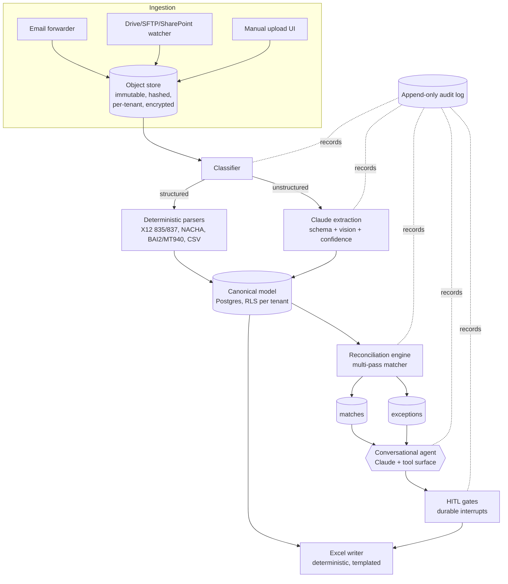

# Bank Reconciliation Agent — Engineering Architecture

Companion to `reconciliation-agent-overview.md` (client-facing). This document
is for the engineering team building the system.

---

## 1. Architectural principles

1. **Perception vs. computation split.** LLMs (Claude) handle perception and
   conversation: classify documents, extract fields, normalize messy text,
   propose explanations, drive the chat. **Deterministic code** handles all
   arithmetic: matching keys, balance computation, the tie-out. The LLM never
   produces a financial conclusion directly — it calls a tool that computes it.
2. **Full provenance.** Every extracted field and every report cell traces to
   `document → page/segment → field → match`. Non-negotiable for audit defense.
3. **Reproducibility.** Extraction results are cached and versioned so a run
   re-executes deterministically; no LLM drift between runs on the same inputs.
4. **Multi-tenant isolation.** Each practice is a tenant/project; PHI in
   ERAs/EOBs makes isolation a HIPAA requirement, not just hygiene.
5. **Human-in-the-loop as durable interrupts.** Approval gates pause a
   persisted workflow and survive restarts (monthly cadence is inherently
   async and multi-day).

---

## 2. The core unit of work: the Reconciliation Run

A **Run** = `(practice, accounting_period, bank_account)`. It is a durable state
machine:

```
INTAKE → CLASSIFIED → EXTRACTED
   → [GATE 1: document completeness]
   → NORMALIZED → MATCHED → EXCEPTIONS_OPEN
   → (conversational resolution loop)
   → [GATE 2: approve resolutions]
   → BALANCED
   → [GATE 3: accountant sign-off]
   → REPORT_GENERATED → DELIVERED
```

Each transition is logged; gates emit a human task and block until resolved.

---

## 3. Component overview



---

## 4. Ingestion

- **Channels:** per-practice email forwarding address (`recon+<practice>@…`),
  drive watchers (S3 / SFTP / Google Drive / SharePoint), manual upload UI.
- Each artifact: file-type sniff + malware scan, content-hash dedupe, store
  immutably under tenant prefix with source metadata; raw file never mutated.
- Enqueue for processing (per-tenant queue / partition).

## 5. Classification & extraction

**Structured-first.** Detect format before involving an LLM:

| Source | Format | Handling |
|---|---|---|
| Insurance remittance (ERA) | X12 **835** | Deterministic EDI parser → claim-level lines, TRN reassociation #, CARC/RARC codes |
| EFT/ACH | **NACHA** (CCD+ addenda) | Deterministic parser → trace #, effective date |
| Bank statement | **BAI2 / MT940** or CSV | Deterministic parser when available |
| PMS / GL / payroll exports | CSV / XLSX | Schema-mapped parser per system (Athena, eClinicalWorks, Kareo, QuickBooks…) |
| Bank stmt PDF, paper EOB, invoices, utility bills | PDF / scan | **Claude** classify → type-specific extraction schema (vision), per-field confidence |

LLM extraction uses tool-use / structured JSON output bound to a JSON Schema per
document type. Output lands in the canonical model with provenance
(`doc_id, page, bbox/segment_ref, confidence`).

## 6. Canonical data model (per tenant)

- `documents` — provenance, hash, source, type, classification confidence
- `bank_transactions` — date, amount, direction, description, type, check#,
  trace#, running balance
- `remittances` / `remittance_lines` — payer, payee, TRN, claim, paid amount,
  adjustments (contractual, recoupment), CARC/RARC
- `expected_payments` — from EFT notices / PMS (payer, amount, eff. date, trace#)
- `payables` — invoices, utilities, payroll (vendor, amount, due date, ref#)
- `issued_checks` — check#, payee, amount, date
- `gl_entries` — account, amount, date, memo, ref
- `matches` — links bank_txn ↔ supporting item(s) ↔ gl_entry; type, confidence,
  explained delta, status
- `exceptions` — type, severity, materiality, payload, proposed resolutions,
  status, audit
- `audit_log` — append-only; actor, action, before/after, timestamp

Row-level security keyed by tenant on every table.

## 7. Reconciliation engine (deterministic, multi-pass)

Bank statement is the source of truth for cash. Three-way tie-out:
**Bank ↔ Remittance/PMS ↔ GL.** Passes run strongest-key first; matched items
are removed from the candidate pool before the next pass.

1. **Exact key** — TRN reassociation # (835 ↔ deposit), check# (↔ register),
   invoice# (↔ payment). Highest confidence.
2. **Amount + date (+ payer)** — within a clearing-lag tolerance window
   (configurable, e.g. ±3 business days for deposits in transit).
3. **Aggregation (1:N / N:1)** — bounded subset-sum within a candidate window:
   one EFT = many claim lines; one card-batch deposit = many copays.
4. **Fuzzy / assisted** — approximate amount where the delta is an explained
   cause (bank/processor fee, payor recoupment/takeback, NSF) + payer-name
   normalization; Claude *ranks* candidates but a match is only recorded with an
   explicit explanatory delta.

Each match stores type, confidence, and a structured **explained delta**.
Produces the formal statement: `bank_ending + deposits_in_transit −
outstanding_checks ± errors = adjusted_book_balance`. Residuals → exceptions.

## 8. Exception management

Typed: `UNMATCHED_DEPOSIT`, `UNMATCHED_DEBIT`, `AMOUNT_MISMATCH`,
`MISSING_DOCUMENT`, `DUPLICATE`, `UNPOSTED_IN_GL`, `POSSIBLE_FRAUD`,
`TIMING_DIFFERENCE`. Each carries structured payload, severity, dollar
materiality, agent-proposed candidate resolutions, status
(`open → proposed → approved/rejected`), full audit trail. Resolutions requiring
external info (e.g. a missing ERA) are flagged for human action rather than
fabricated.

## 9. Conversational agent

Claude orchestrates over a **fixed tool surface** on the run's data — no
free-hand math:

`list_exceptions` · `get_transaction` · `get_document` / `get_source_excerpt` ·
`search_remittances` · `propose_match` · `confirm_match` ·
`recompute_reconciliation` · `propose_journal_adjustment` ·
`request_human_confirmation` · `generate_report`

The Run is shared state; the conversation mutates it only through tools. RAG over
the run's documents answers "where did this number come from." Model tiering:
a high-capability Claude model for ambiguous exception triage; a faster Claude
tier for bulk classification/extraction; vision for scanned docs. LLM access
sits behind a provider abstraction (hosting **TBD** — Bedrock vs. Anthropic+BAA
decided later with compliance).

## 10. Human-in-the-loop gates

Implemented as durable workflow interrupts (Temporal or LangGraph-style):
1. Document completeness (agent diffs received vs. expected from prior
   periods/payor calendar).
2. Low-confidence (< threshold) or high-materiality (> $ threshold) matches.
3. Exception resolutions (adjustments, write-offs, reclassifications).
4. Final reconciliation sign-off before report generation.

Thresholds configurable per practice.

## 11. Output generation

Deterministic Excel writer (openpyxl) from a template — **not** LLM-authored.
Tabs: Summary/sign-off · Bank reconciliation statement · Matched deposits
(with TRN) · Matched disbursements · Outstanding checks · Deposits in transit ·
Exceptions & resolutions · Source-document index. Cells reference source rows;
Claude additionally drafts an NL executive summary.

## 12. Cross-cutting

- **Storage:** Postgres (canonical model, RLS) + object store (raw docs,
  per-tenant KMS, encrypted at rest/in transit).
- **Audit:** append-only log of every extraction, match, override, approval —
  actor + timestamp + before/after.
- **HIPAA:** BAA-covered Claude deployment, PHI minimization in prompts,
  encryption, access controls; hosting choice abstracted/TBD.
- **Reproducibility:** versioned, cached extractions; deterministic re-run.

## 13. Recommended stack

Durable workflow (Temporal / LangGraph) · Python + FastAPI · Postgres · S3 +
queue · dedicated X12 835/837 + NACHA + BAI2 parsers · Claude (tiered, behind a
provider abstraction) · openpyxl · web UI (chat + exception worklist + run
dashboard).

## 14. Build sequence

1. Canonical model + ingestion + immutable store.
2. Deterministic parsers (835, NACHA, BAI2, CSV mappers) — covers most volume.
3. Reconciliation engine passes 1–2 + tie-out + Excel writer (vertical slice).
4. Claude extraction for unstructured docs + provenance.
5. Exception model + conversational agent + tool surface.
6. HITL gates as durable interrupts.
7. Aggregation/fuzzy matching passes 3–4.
8. Hardening: audit, RLS, HIPAA controls, multi-tenant scale.
